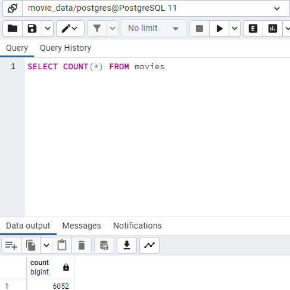
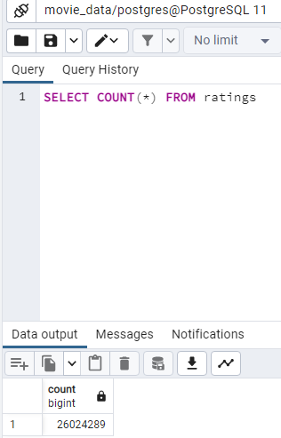

# Movies_ETL
Extract, Transform and Load Movie Data for Amazing Prime

# Overview & Purpose of the Project 

The goal of this project is to provide Amazing Prime with an automated ETL pipeline so that they may keep their movie data updated on a daily basis. 

I have refactored code from the module to create a singular function that takes in new data from the three files—Wikipedia data, Kaggle metadata, and the MovieLens rating data—performs the appropriate transformations and is completed by loading the data into existing tables in a PostgreSQL database.

## Deliverables

### 1: Write an ETL Function to Read Three Data Files

[ETL_function_test.ipynb](https://github.com/ashleycvirga/Movies_ETL/blob/1c5b516f62ce1054698c7bc57843e11b65c137f9/ETL_function_test.ipynb)

### 2: Extract and Transform the Wikipedia Data

[ETL_clean_wiki_movies.ipynb](https://github.com/ashleycvirga/Movies_ETL/blob/1c5b516f62ce1054698c7bc57843e11b65c137f9/ETL_clean_wiki_movies.ipynb)

### 3: Extract and Transform the Kaggle Data

[ETL_clean_kaggle_data.ipynb](https://github.com/ashleycvirga/Movies_ETL/blob/c12c6b598e89873383b006d8283ad6ef045836aa/ETL_clean_kaggle_data.ipynb)

### 4: Create the Movie Database

[ETL_create_database.ipynb]()

Confirmed the 'movies' table has 6,052 rows.

Confirmed the 'ratings' table has 26,024,289 rows.

## Notes

I would like to note that for Deliverable 2 & 3, my clean DataFrame "wiki_movies_df" has dropped the original uncleaned columns for 'Box Office', 'Budget', 'Release date', and 'Running time' as they were replaced with the new clean data columns 'box_office', 'budget', 'release_date', and 'running_time' respectively.

This was done in an effort to remove superlative/uncleaned data and improve readability.

This does differ from the Module 8 Challenge Instructions examples. 
